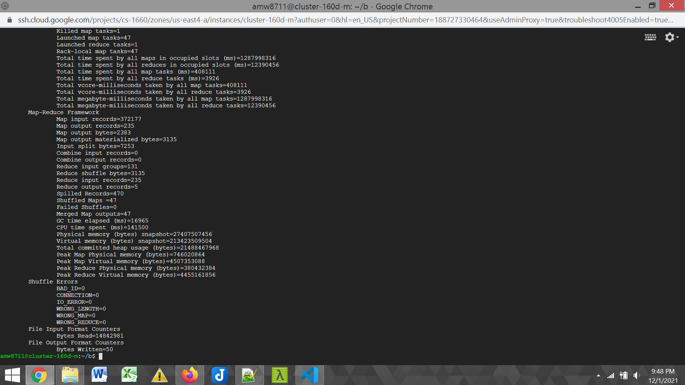

# CS1660_HW5
University of Pittsburgh CS 1660 Cloud Computing Homework 5 involving Hadoop, MapReduce, and Google Cloud Platform 

## Source Code

Located in [TopN](TopN.java)

## Output

Located in [output](output.txt)

```
said	6296
thou	4642
would	3401
thy	2467
king	2157
```

## Cloud Account 


## TopN MapReduce Execution on GCP



